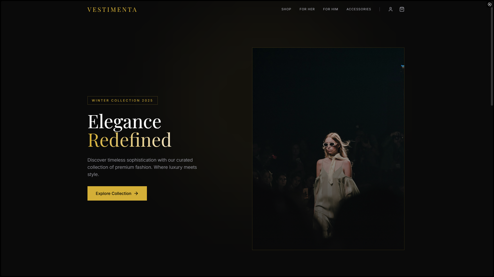
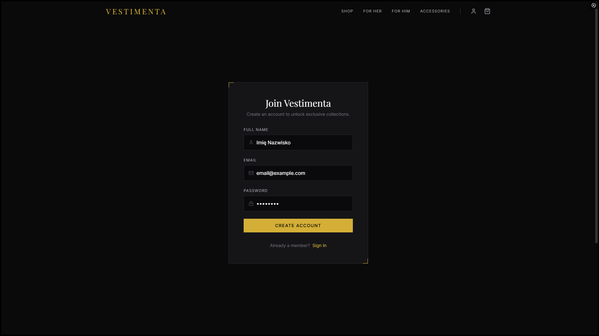
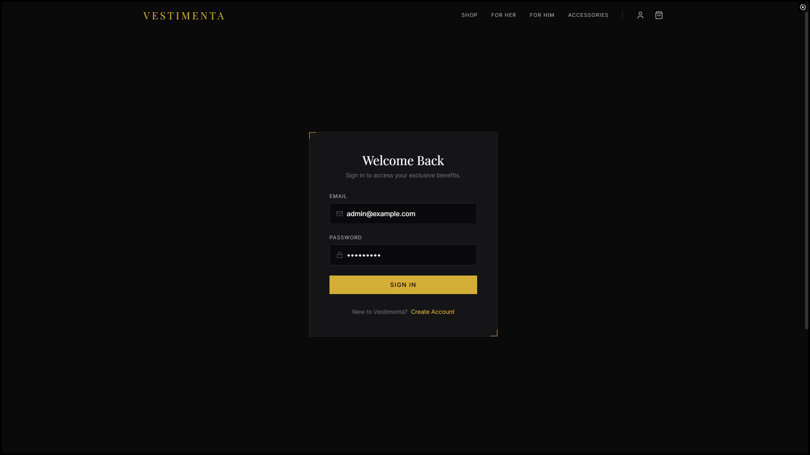
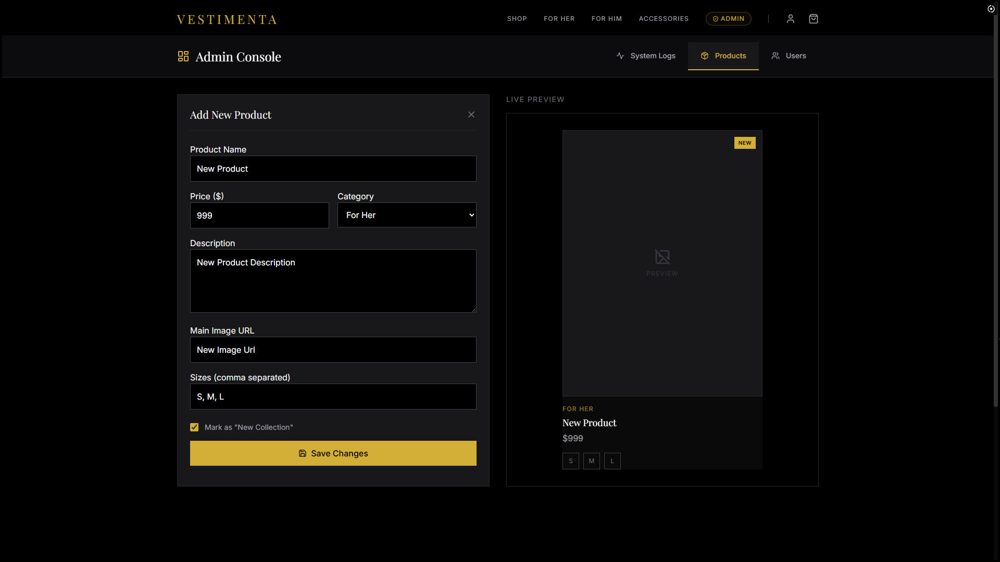
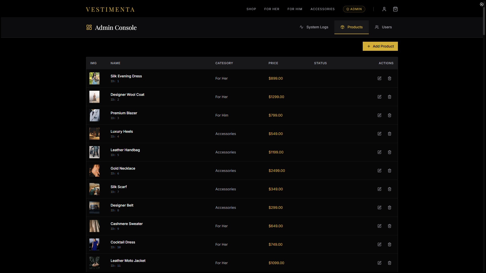
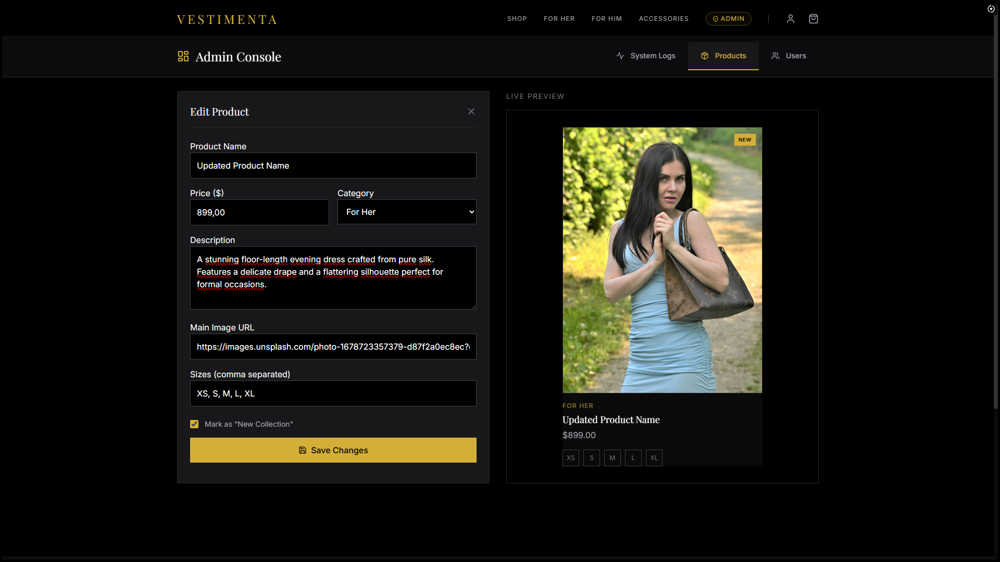
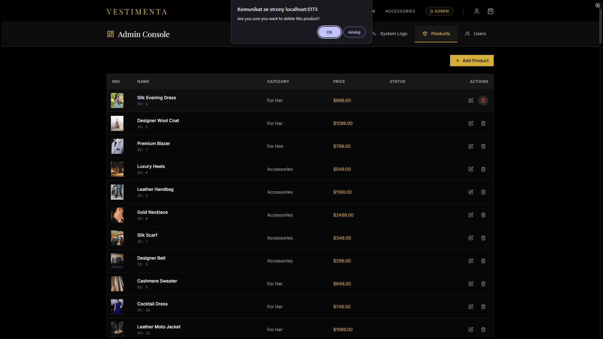
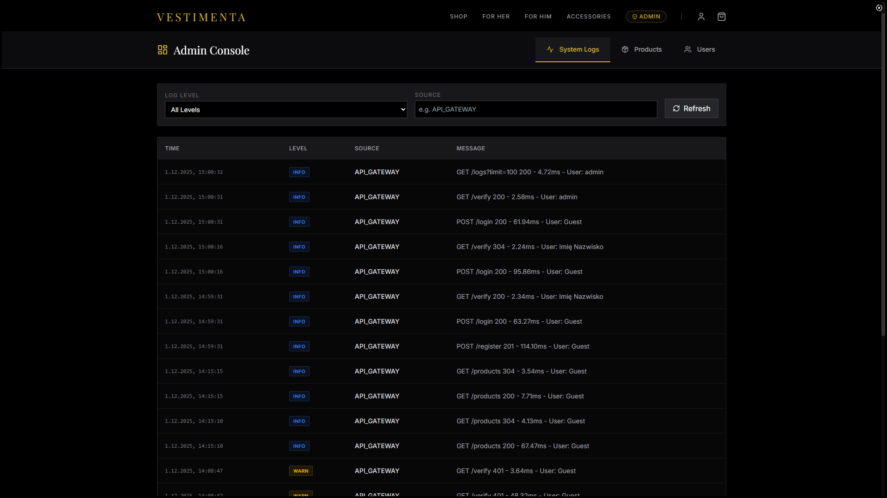

# Vestimenta - Luxury Fashion E-commerce System

Projekt to aplikacja e-commerce oparta na architekturze mikroserwisów, w której `API Gateway` działa jako centralny punkt dostępu do systemu. Poszczególne serwisy domenowe (np. obsługa produktów, zamówień czy użytkowników) funkcjonują jako niezależne komponenty uruchamiane w kontenerach Docker, komunikujące się przez lekkie interfejsy HTTP.
Warstwę prezentacji stanowi frontend zbudowany w React, który łączy dane z wielu usług i prezentuje je użytkownikowi w spójny sposób.
Projekt został przygotowany jako praca zaliczeniowa z przedmiotu Przetwarzanie Rozproszone, demonstrując praktyczne zastosowanie architektury rozproszonej w środowisku `Node.js` i `Docker`, wraz z konfiguracją kluczowych wzorców takich jak API Gateway, separacja domen czy konteneryzacja usług.

## Link do repo -> [tutaj](https://github.com/logyQT/PR_Projekt_GK) <-

# Spis treści

## 1. [Uruchomienie środowiska developerskiego (Local Development)](#1-uruchomienie-środowiska-developerskiego)

## 2. [Uruchomienie środowiska produkcyjnego (Docker Compose)](#2-uruchomienie-środowiska-produkcyjnego)

## 3. [Stos technologiczny i Architektura (Tech Stack)](#3-stos-technologiczny-i-architektura)

## 4. [Dokumentacja API (API Docs)](#4-opis-endpointów)

## 5. [Prezentacja działania aplikacji (wg wymagań projektowych)](#5-prezentacja-działania-aplikacji)

<div style="page-break-after: always"></div>

## 1. Uruchomienie środowiska developerskiego

---

Aby uruchomić projekt lokalnie bez konteneryzacji, wymagana jest manualna konfiguracja bazy danych oraz instalacja zależności Node.js dla każdego serwisu.

### Wymagania wstępne

- **Node.js** (v18 lub nowszy)
- **PostgreSQL** (działający na porcie `5432`)

### Konfiguracja Bazy Danych

Projekt wymaga dwóch osobnych baz danych PostgreSQL. Należy je utworzyć ręcznie w swoim kliencie SQL (np. pgAdmin, psql):

1.  Baza danych użytkowników: `auth_db`
2.  Baza danych produktów: `products_db`

> **Domyślna konfiguracja połączenia** (zdefiniowana w plikach `database.js`):
>
> - Host: `localhost`
> - User: `postgres`
> - Password: `password`
> - Port: `5432`
>
> _Jeśli lokalna konfiguracja Postgresa różni się od powyższej, należy ustawić odpowiednie zmienne środowiskowe (np. `DB_USER`, `DB_PASSWORD`) przed uruchomieniem serwisów._

### Instalacja i Uruchomienie

Projekt wykorzystuje strukturę typu monorepo. Należy zainstalować zależności dla każdego mikroserwisu oraz klienta, a następnie uruchomić całość za pomocą skryptu orkiestrującego w głównym katalogu.

1.  **Instalacja zależności:**
    Należy wejść do każdego katalogu i wykonać `npm install`:

    ```bash
    # Główny katalog (dla narzędzi deweloperskich jak nodemon/concurrently)
    npm install

    # Serwisy
    cd app/Services/ApiGate && npm install
    cd ../AuthAPI && npm install
    cd ../ProductsAPI && npm install
    cd ../LoggingAPI && npm install

    # Frontend
    cd ../../Client && npm install
    ```

2.  **Seedowanie bazy danych (Inicjalizacja danych):**
    Uruchom skrypt, który utworzy tabele i doda przykładowe dane (użytkowników i produkty).

    ```bash
    # Z głównego katalogu projektu
    npm run init-db
    ```

3.  **Start aplikacji:**
    Uruchomienie wszystkich serwisów oraz frontendu w trybie `watch` (z wykorzystaniem `concurrently` i `nodemon`):
    ```bash
    npm run dev
    ```
    - **Frontend:** Dostępny pod `http://localhost:5173` (Vite dev server)
    - **API Gateway:** Dostępny pod `http://localhost:4000`

---

<div style="page-break-after: always"></div>

## 2. Uruchomienie środowiska produkcyjnego

---

Środowisko produkcyjne jest w pełni skonteneryzowane przy użyciu **Docker** oraz **Docker Compose**. Zapewnia to izolację serwisów w wewnętrznej sieci oraz automatyczną konfigurację baz danych.

### Instrukcja uruchomienia

1.  **Zbudowanie i uruchomienie kontenerów:**
    Polecenie to buduje obrazy dla Clienta i Serwisów, a następnie uruchamia je w tle.

    ```bash
    docker-compose up -d --build
    ```

2.  **Inicjalizacja baz danych (Seeding):**
    Kontenery `auth-seed` oraz `products-seed` są zdefiniowane w profilu `init`, więc nie uruchamiają się automatycznie. Należy je wywołać ręcznie, aby zaludnić bazy danych działające w kontenerach `auth-db` i `products-db`.

    ```bash
    docker-compose run --rm auth-seed
    docker-compose run --rm products-seed
    ```

3.  **Dostęp do aplikacji:**
    Aplikacja jest dostępna pod adresem: **`http://localhost`** (obsługiwana przez serwer Nginx na porcie 80).

4.  **Zatrzymanie środowiska:**
    Aby zatrzymać kontenery i usunąć wolumeny (wyczyszczenie danych):
    ```bash
    docker-compose down -v
    ```

---

<div style="page-break-after: always"></div>

## 3. Stos technologiczny i Architektura

---

Projekt realizuje wzorzec architektury mikroserwisowej z centralnym punktem dostępu (API Gateway) oraz separacją warstwy prezentacji.

### Frontend (Client)

- **Stack:** React 18, TypeScript, Vite.
- **Styling:** Tailwind CSS (w tym typografia i animacje).
- **State Management:** React Context API (`AuthContext`, `CartContext`).
- **Komunikacja:** Biblioteka `axios` do zapytań HTTP.
- **Routing:** React Router DOM (HashRouter).

### API Gateway

- **Technologia:** Node.js, Express.
- **Rola:** Działa jako **Reverse Proxy** i agregator. Jest jedynym punktem kontaktu dla Frontendu.
- **Middleware:**
  - **Auth Middleware:** Weryfikuje tokeny JWT, odpytując synchronicznie serwis `AuthAPI` (`POST /verify`).
  - **Logger Middleware:** Asynchronicznie wysyła metadane każdego zapytania (metoda, czas trwania, użytkownik) do serwisu `LoggingAPI`.
  - **Role Middleware:** Zabezpiecza endpointy na podstawie roli użytkownika (admin/user).
- **Komunikacja:** Przekazuje żądania do mikroserwisów (`AuthAPI`, `ProductsAPI`) używając wewnętrznych zapytań HTTP (Axios).

### Mikroserwisy (Backend)

Każdy serwis posiada własną odpowiedzialność domenową i (w większości) własną bazę danych.

1.  **Auth Service:**
    - Odpowiedzialność: Rejestracja, logowanie, zarządzanie użytkownikami, weryfikacja tokenów JWT.
    - Baza: PostgreSQL (`users` table).
    - Security: Haszowanie haseł przy użyciu `bcrypt`.
2.  **Products Service:**
    - Odpowiedzialność: CRUD dla produktów.
    - Baza: PostgreSQL (`products` table).
3.  **Logging Service:**
    - Odpowiedzialność: Agregacja logów systemowych.
    - Storage: In-memory storage (tablica w pamięci RAM procesu).

### Komunikacja w środowisku produkcyjnym

W środowisku Docker Compose serwisy komunikują się w dedykowanej sieci wewnętrznej `internal_net`, która jest niedostępna z zewnątrz.

- `api-gateway` widzi serwisy pod ich nazwami hostów: `http://auth-service:4002`, `http://products-service:4003`, etc.
- Frontend komunikuje się wyłącznie z Nginx (port 80).

### Rola serwera Nginx

W środowisku produkcyjnym Nginx pełni podwójną rolę (zdefiniowaną w `nginx.conf`):

1.  **Web Server:** Serwuje statyczne pliki zbudowanej aplikacji React (SPA) z katalogu `/usr/share/nginx/html`.
2.  **Reverse Proxy:** Przekierowuje zapytania zaczynające się od `/api/` do kontenera `api-gateway` na port `4000`.
    - Dzięki temu omijane są problemy z **CORS** (Same-Origin Policy), ponieważ zarówno frontend, jak i API są dostępne pod tą samą domeną/portem.
    - W Dockerfile klienta następuje podmiana `base URL` w pliku `api.ts` z `http://localhost:4000` na relatywną ścieżkę `/api`, co umożliwia poprawne routowanie przez Nginx.

---

<div style="page-break-after: always"></div>

## 4. Opis endpointów

---

Poniżej znajduje się zestawienie kluczowych endpointów wystawianych przez **API Gateway**.

### Publiczne (Open)

Dostępne bez tokena autoryzacyjnego.

- `GET /`: Sprawdzenie statusu API Gateway.
- `POST /login`: Logowanie użytkownika. Przekazuje credentials do Auth Service, zwraca JWT.
- `POST /register`: Rejestracja nowego użytkownika.
- `GET /products`: Pobranie listy wszystkich produktów. Obsługuje query params do filtrowania.

### Użytkownik (User)

Wymagają nagłówka `Authorization: Bearer <token>`.

- `GET /me`: Pobranie danych profilowych zalogowanego użytkownika.
- `PATCH /me`: Aktualizacja profilu (email, nazwa).
- `DELETE /me`: Usunięcie własnego konta (wymaga podania hasła dla potwierdzenia).

### Administrator (Admin)

Wymagają tokena z rolą `admin`.

- `GET /users`: Pobranie listy użytkowników. Obsługuje filtrowanie po `role`, `username`, `email`.
- `POST /users`: Utworzenie nowego użytkownika (przez admina).
- `PUT /users`: Pełna edycja/nadpisanie użytkownika.
- `PATCH /users`: Częściowa edycja użytkownika.
- `GET /logs`: Pobranie logów systemowych z serwisu LoggingAPI.
- `GET /health`: Sprawdzenie stanu zdrowia wszystkich mikroserwisów (Gateway odpytuje endpointy `/health` każdego serwisu).

<div style="page-break-after: always"></div>

## 5. Prezentacja działania aplikacji.

---

### 5.1. Landing Page



### 5.2 Rejestracja użytkownika



<div style="page-break-after: always"></div>

### 5.3 Logowanie użytkownika



### 5.4 CRUD na produktach z panelu Administratora

### 5.4.1 C - Create



<div style="page-break-after: always"></div>

### 5.4.2 R - Read



### 5.4.3 U - Update



<div style="page-break-after: always"></div>

### 5.4.4 D - Delete



### 5.5 Wgląd do logów z panelu Administratora


